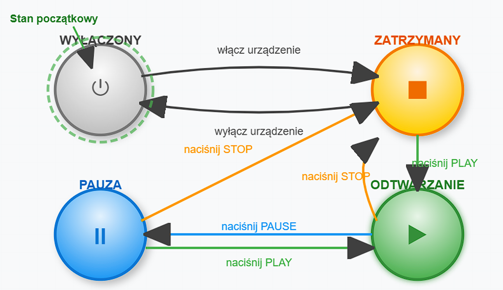
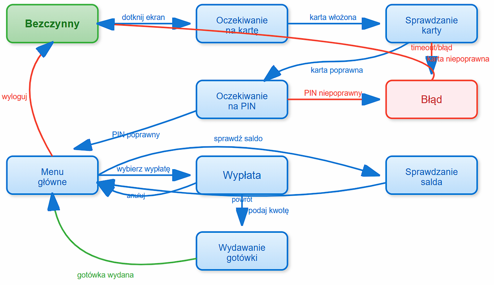

# Lab 11 - przejścia miedzy stanami

## 1. Czym jest stan w systemie?

**Stan systemu** to aktualna sytuacja programu, która zależy od:

* wcześniejszych operacji
* danych wejściowych
* wykonanych akcji

Innymi słowy:

> stan opisuje, w jakiej „sytuacji logicznej” znajduje się system.

Przykłady stanów:

* konto **zalogowane / niezalogowane**
* zamówienie **utworzone / opłacone / wysłane**
* automat **czekający na monetę / wydający produkt**

---

## 2. Na czym polega testowanie przejść między stanami?

**State Transition Testing** polega na sprawdzaniu:

* czy system przechodzi **między stanami poprawnie**
* czy **niepoprawne przejścia są blokowane**
* czy reakcja systemu na zdarzenia jest prawidłowa

Testujemy więc:

1. **stan początkowy**
2. **zdarzenie**
3. **stan końcowy**

---

## 3. Model przejść stanów

System można przedstawić jako **automat stanowy**.

Elementy modelu:

| element   | znaczenie                     |
| --------- | ----------------------------- |
| stan      | aktualny stan systemu         |
| zdarzenie | akcja użytkownika lub systemu |
| przejście | zmiana stanu                  |
| akcja     | reakcja systemu               |

---

## 4. Przykład – system logowania

System może mieć stany:

```
Zablokowane
Zalogowane
Niezalogowane
```

Reguły:

| stan          | zdarzenie      | nowy stan     |
| ------------- | -------------- | ------------- |
| niezalogowany | poprawne hasło | zalogowany    |
| niezalogowany | błędne hasło   | niezalogowany |
| niezalogowany | 3 błędne próby | zablokowany   |

---

## 5. Diagram przejść stanów

```
Niezalogowany
     |
 poprawne hasło
     v
Zalogowany

Niezalogowany
     |
 3 błędne próby
     v
Zablokowany
```

---

## 6. Przykład implementacji w Pythonie

Załóżmy prosty system logowania.

```python
class LoginSystem:

    def __init__(self):
        self.state = "unlocked"
        self.failed_attempts = 0

    def login(self, password):
        if self.state == "locked":
            return "account locked"

        if password == "secret":
            self.failed_attempts = 0
            self.state = "logged"
            return "logged in"
        else:
            self.failed_attempts += 1

            if self.failed_attempts >= 3:
                self.state = "locked"

            return "wrong password"
```

---

## 7. Testy jednostkowe (unittest)

Testujemy **przejścia między stanami**.

```python
import unittest

class TestLoginSystem(unittest.TestCase):

    def test_successful_login(self):
        system = LoginSystem()
        result = system.login("secret")

        self.assertEqual(result, "logged in")
        self.assertEqual(system.state, "logged")

    def test_failed_attempt(self):
        system = LoginSystem()
        system.login("bad")

        self.assertEqual(system.state, "unlocked")

    def test_lock_after_three_attempts(self):
        system = LoginSystem()

        system.login("bad")
        system.login("bad")
        system.login("bad")

        self.assertEqual(system.state, "locked")
```

---

## 8. Testowanie niepoprawnych przejść

Bardzo ważna część testów.

Sprawdzamy czy system **nie pozwala na niedozwolone przejścia**.

```python
def test_login_when_locked(self):
    system = LoginSystem()

    system.login("bad")
    system.login("bad")
    system.login("bad")

    result = system.login("secret")

    self.assertEqual(result, "account locked")
```

---

## 9. Tablica przejść stanów

Często tworzy się **tablicę przejść**.

| stan     | zdarzenie        | nowy stan |
| -------- | ---------------- | --------- |
| unlocked | correct password | logged    |
| unlocked | wrong password   | unlocked  |
| unlocked | 3 wrong attempts | locked    |
| locked   | login attempt    | locked    |

Na jej podstawie tworzy się **przypadki testowe**.

---

## 10. Pokrycie przejść stanów

Możemy mierzyć pokrycie:

### 1. State coverage

Czy każdy stan został odwiedzony.

### 2. Transition coverage

Czy każde przejście zostało przetestowane.

### 3. Transition pair coverage

Czy sprawdzono **sekwencje przejść**.

---

## 11. Przykłady systemów gdzie ta technika jest ważna

Testowanie przejść stanów stosuje się szczególnie w systemach:

| system             | przykłady     |
| ------------------ | ------------- |
| autoryzacja        | login, konta  |
| workflow           | zamówienia    |
| automaty           | bankomaty     |
| protokoły sieciowe | TCP           |
| gry                | stany postaci |

---

## 12. Przykład bardziej złożony – zamówienie

Stany zamówienia:

```
created → paid → shipped → delivered
```

Niedozwolone przejścia:

```
created → delivered
paid → created
```

Testy sprawdzają czy:

* dozwolone przejścia działają
* niedozwolone są blokowane

---

## 13. Przykład testu w pytest

```python
def test_order_transition():
    order = Order()

    order.pay()

    assert order.state == "paid"

    order.ship()

    assert order.state == "shipped"
```

---

## 14. Zalety testowania przejść stanów

| zaleta                           | opis               |
| -------------------------------- | ------------------ |
| dobre dla systemów sekwencyjnych | workflow           |
| wykrywa błędy logiki             | kolejność operacji |
| pozwala modelować system         | diagramy stanów    |

---

## 15. Ograniczenia techniki

| problem             | opis                  |
| ------------------- | --------------------- |
| eksplozja stanów    | dużo możliwych stanów |
| trudne modele       | w złożonych systemach |
| wymaga dokumentacji | diagramów stanów      |

---

## 16. Podsumowanie

**Testowanie przejść stanów** polega na sprawdzaniu czy system:

* przechodzi między stanami poprawnie
* reaguje właściwie na zdarzenia
* blokuje niedozwolone przejścia

Technika ta jest szczególnie przydatna w systemach:

* logowania
* zamówień
* workflow
* automatach i protokołach.

# Zadanie

Zastosuj technikę testowania przejść między stanami do zaprojektowania przypadków testowych dla swojego projektu, które spełnią pokrycie:
- a) stanów,
- b) poprawnych przejść,
- c) wszystkich przejść.



